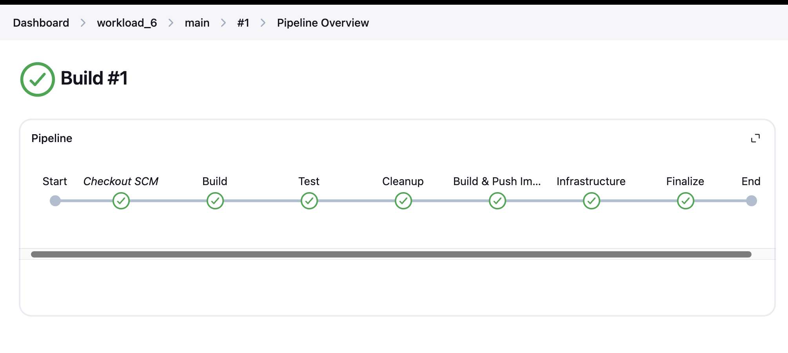
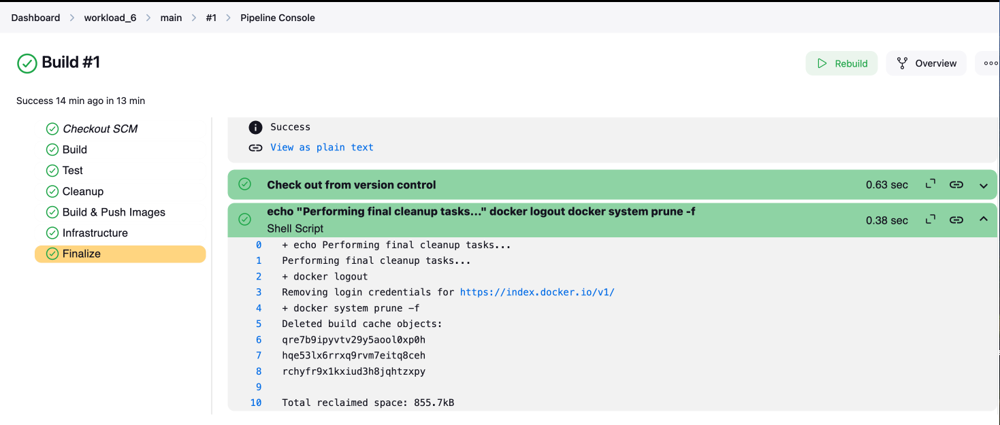
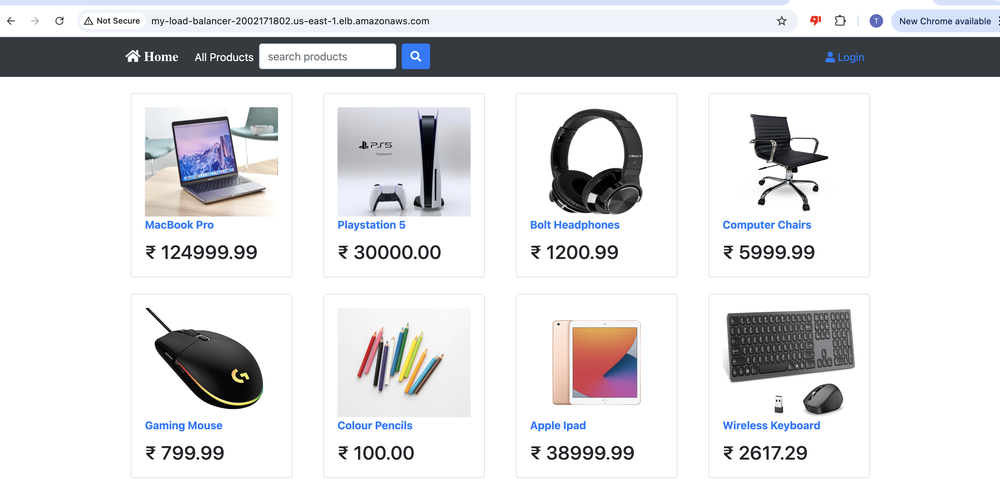
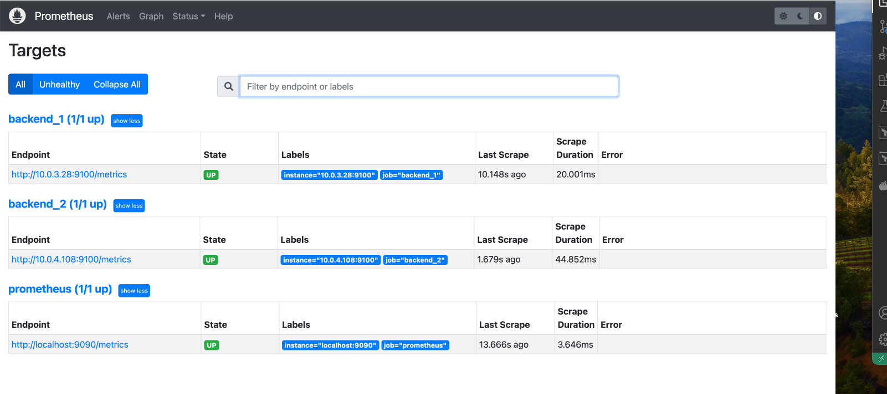
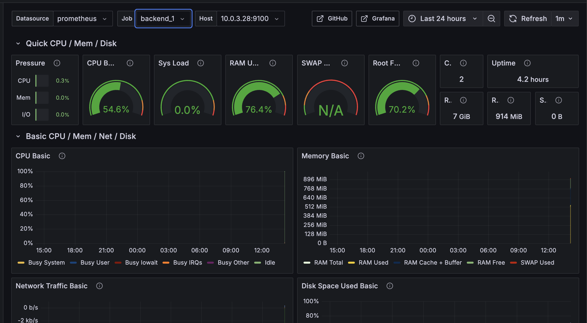
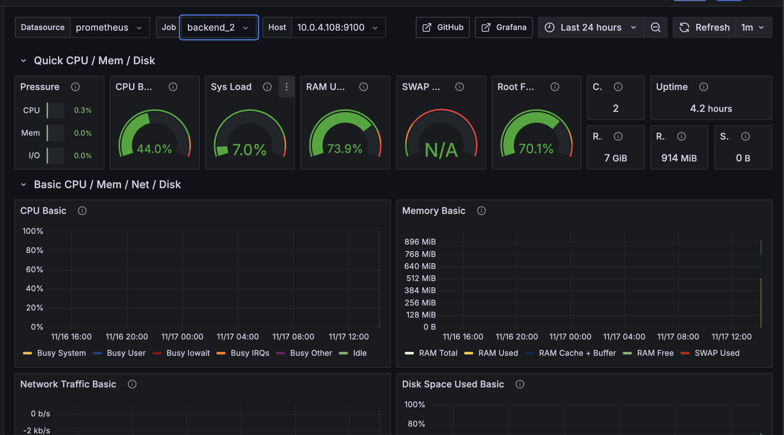
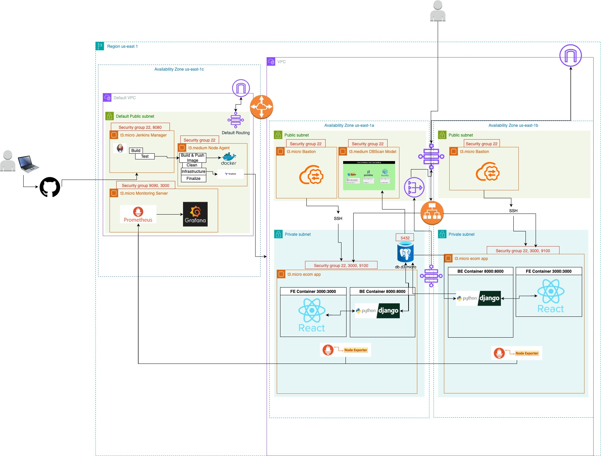

# Deploying Ecommerce Application using Docker

## Purpose

The purpose of this workload is to deploy an e-commerce application onto AWS infrastructure using a combination of Docker, Terraform, and Jenkins. The objective is to ensure the application is secure, highly available, and fault-tolerant while leveraging modern DevOps practices. Specifically, the workload focuses on:

1. **Containerization**: Packaging the frontend and backend components of the application into Docker containers, making the deployment consistent across environments.

2. **CI/CD Pipeline**: Using Jenkins to automate the process of building, testing, and deploying the application. This includes:
   - Building and pushing Docker images to Docker Hub.
   - Deploying the application via Docker Compose on EC2 instances.

3. **Infrastructure as Code (IaC)**: Utilizing Terraform to define and provision AWS infrastructure, including VPC, EC2 instances, RDS, and an ALB. This ensures the infrastructure is repeatable and version-controlled.

4. **Monitoring and Troubleshooting**: Setting up Prometheus and Grafana to monitor the application servers' resources and create dashboards for insights into system performance.

5. **Secure and Scalable Deployment**: Placing the application containers in private subnets for security while routing traffic through a load balancer in public subnets. Bastion servers are used for SSH access to private instances, ensuring a secure and scalable architecture.

This workload demonstrates how to combine containerization, automation, and IaC to deploy and manage a modern web application effectively.

## Instructions

1. Clone this repo to your GitHub account and call it "ecommerce_docker_deployment".

2. Create a t3.micro EC2 called "Jenkins". This will be your Jenkins Manager instance. Install Jenkins and Java 17 onto it.

3. Create a t3.medium EC2 called "Docker_Terraform". This will be your Jenkins NODE instance. Install Java 17, Terraform, Docker, and AWS CLI onti it.  For this workload it would be easiest to use the same .pem key for both of these instances to avoid confusion when trying to connect them. Ensure your Docker_Terraform instance can create infrastructure without requiring access keys by attaching an IAM role to the instance with the appropriate permissions. 

    * [Create an EC2 Instance](https://github.com/kura-labs-org/AWS-EC2-Quick-Start-Guide/blob/main/AWS%20EC2%20Quick%20Start%20Guide.pdf).
    * [Jenkins Install Script](https://github.com/tjwkura5/microblog_VPC_deployment/blob/main/scripts/jenkins_install.sh)
    * [Install Terraform](https://developer.hashicorp.com/terraform/tutorials/aws-get-started/install-cli)
    * [Install Docker](https://docs.docker.com/engine/install/ubuntu/)
    * [Post Install Docker](https://docs.docker.com/engine/install/linux-postinstall/#manage-docker-as-a-non-root-user)
    * [Assign IAM role to EC2 Instance](https://docs.aws.amazon.com/IAM/latest/UserGuide/id_roles_use_switch-role-ec2.html)


4. The next few steps are for setting up a Jenkins Node Agent.

    a. Make sure both instances are running and then log into the Jenkins console in the Jenkins Manager instance.  On the left side of the home page under the navigation panel and "Build Queue", Click on "Build Executor Status"

    b. Click on "New Node"

    c. Name the node "build-node" and select "Permanent Agent"

    d. On the next screen,
  
    ```
      i. "Name" should read "build-node"

      ii. "Remote root directory" == "/home/ubuntu/agent"

      iii. "Labels" == "build-node"

      iv. "Usage" == "Only build jobs with label expressions matching this node"

      v. "Launch method" == "Launch agents via SSH"

      vi. "Host" is the public IP address of the Node Server

      vii. Click on "+ ADD" under "Credentials" and select "Jenkins".

      viii. Under "Kind", select "SSH Username with private key"

      ix. "ID" == "build-node"

      x. "Username" == "ubuntu"

      xi. "Private Key" == "Enter directly" (paste the entire private key of the Jenkins node instance here. This must be the .pem file)

      xi. Click "Add" and then select the credentials you just created.  

      xii. "Host Key Verification Strategy" == "Non verifying Verification Strategy"

      xiii. Click on "Save"
      ```

   e. Back on the Dashboard, you should see "build-node" under "Build Executor Status".  Click on it and then view the logs.  If this was successful it will say that the node is "connected and online".

5. Create terraform file(s) for creating the infrastructure. We will be using four modules as outlined below:

    ### VPC ###
    - 1x Custom VPC named "wl6vpc" in us-east-1
    - 2x Availability Zones, we're using us-east-1a and us-east-1b.
    - 2x Public Subnets and 2x Private Subnets. One of each in each AZ.
    - 1x Internet Gateway, 1x NAT Gateways and 1x Elastic IP to assign to my NAT Gateway, one NAT in one     Public Subnet. 
    - 2x Route Tables, 1x Public Route Table for both Public Subnets, 1x Route Table for both private subnets
    - 4x Route Table Associations.
        - 2x for Public Subnets to Public Route Table.
        - 2x for Private Subnets to Private Route Table.
    - 1x VPC Peering Connection between Default VPC and wl6vpc VPC.
    - Resources to call Default VPC resources and assign proper routing and associations where needed for the Default VPC to communicate with Custom VPC.
    - 1x App Security Group

    ### EC2 ###
    - 2x Bastion Servers, 1x in each Public Subnet, in each AZ.
    These must be named "ecommerce_bastion_az1" and "ecommerce_bastion_az2" respectively.
    - 1x Bastion Security Group associated to the Bastion servers.
    - 2x App Servers, 1x in each Private Subnet, in each AZ.
    These must be named "ecommerce_app_az1" and "ecommerce_app_az2" respectively.
    - Associate app security group created in VPC module to the app servers.

    ### RDS ###
    - 1x RDS Postgres DB
    - 1x RDS Subnet Group, associating to the 2 Backend Private Subnets.
    - 1x RDS Security Group, determining what ports are open and which addresses can enter those ports.

    ### ALB ###
    - 1x Application Load Balancer
    - 1x Application Load Balancery Security Group, allowing port 80.
    - 1x Listener on Port 80
    - 1x Target Group for Port 3000
    - 2x Target Group Attachments, 1x for each App Server at port 3000.

    Use the following "user_data" code for your App EC2 resource block:
    ```
    user_data = base64encode(templatefile("./deploy.sh", {
        rds_endpoint = var.rds_endpoint,
        docker_user = var.dockerhub_username,
        docker_pass = var.dockerhub_password,
        docker_compose = templatefile("./compose.yml", {
            rds_endpoint = var.rds_endpoint
        })
    }))
    ```

    Note: In the root main.tf we want to ensure that the resources are created in the following order:

    * VPC
    * RDS
    * EC2
    * Load

    We can accomplish like so:

    ```
    module "RDS" {
        source = "./modules/database"
        vpc_id = module.VPC.vpc_id
        private_subnet_id = module.VPC.private_subnet_id_1
        private_subnet_id_2 = module.VPC.private_subnet_id_2
        app_security_group_id = module.VPC.app_security_group_id
        depends_on = [module.VPC]
    }
    ```

    NOTE: Notice what is required for the user data block. (var.dockerhub_username, var.dockerhub_password, deploy.sh, compose.yaml, and var.rds_endpoint) Make sure that you declare the required variables and create the deploy.sh and compose.yml and place them in the same directory as your main.tf.

6. Create a deploy.sh file that will run in "user_data".
  
    a. This script must do the following in order:
  
    * install docker and docker-compose;

    * log into DockerHub;

    * create the docker-compose.yaml with the following code:

        
        ```
        echo "[$(date '+%Y-%m-%d %H:%M:%S')] Creating app directory..."
        mkdir -p /app
        cd /app
        echo "[$(date '+%Y-%m-%d %H:%M:%S')] Created and moved to /app"
        echo "[$(date '+%Y-%m-%d %H:%M:%S')] Creating docker-compose.yml..."
        cat > docker-compose.yml <<EOF
        ${docker_compose}
        EOF
        echo "[$(date '+%Y-%m-%d %H:%M:%S')] docker-compose.yml created"

        ```
    The preceding code dynamically creates a docker-compose.yml file in the /app directory by writing the content of the `${docker_compose}` variable into the file using the `cat` command and a here-document (`<<EOF ... EOF`). This substitutes the value of `${docker_compose}` at runtime, ensuring the file is generated with the desired configuration.

    * run `docker-compose pull`

    * run `docker-compose up -d --force-recreate`

    * Clean the server by running a docker system prune and logging out of dockerhub.  

    ```
    #!/bin/bash

    # Redirect stdout and stderr to a log file
    exec > /var/log/user-data.log 2>&1

    # Install Node Exporter
    echo "Installing Node Exporter..."
    sudo apt-get update -y
    sudo apt-get install -y wget
    wget https://github.com/prometheus/node_exporter/releases/download/v1.6.0/node_exporter-1.6.0.linux-amd64.tar.gz
    tar xvfz node_exporter-1.6.0.linux-amd64.tar.gz
    sudo mv node_exporter-1.6.0.linux-amd64/node_exporter /usr/local/bin/
    rm -rf node_exporter-1.6.0.linux-amd64*

    cat <<EOL | sudo tee /etc/systemd/system/node_exporter.service
    [Unit]
    Description=Node Exporter

    [Service]
    User=ubuntu
    ExecStart=/usr/local/bin/node_exporter

    [Install]
    WantedBy=multi-user.target
    EOL

    sudo systemctl daemon-reload
    sudo systemctl start node_exporter
    sudo systemctl enable node_exporter
    echo "Node Exporter installed and running."

    # Install Docker and Docker Compose
    echo "Installing Docker..."
    sudo apt-get update
    sudo apt-get install -y ca-certificates curl
    sudo install -m 0755 -d /etc/apt/keyrings
    sudo curl -fsSL https://download.docker.com/linux/ubuntu/gpg -o /etc/apt/keyrings/docker.asc
    sudo chmod a+r /etc/apt/keyrings/docker.asc
    echo "deb [arch=$(dpkg --print-architecture) signed-by=/etc/apt/keyrings/docker.asc] https://download.docker.com/linux/ubuntu $(. /etc/os-release && echo "$VERSION_CODENAME") stable" | sudo tee /etc/apt/sources.list.d/docker.list > /dev/null
    sudo apt-get update
    sudo apt-get install -y docker-ce docker-ce-cli containerd.io docker-buildx-plugin docker-compose-plugin
    docker --version
    echo "Docker installed successfully."

    sleep 60

    ### Post Install Docker Group
    sudo groupadd docker
    sudo usermod -aG docker $USER
    newgrp docker

    # Log into DockerHub
    echo "Logging into DockerHub..."
    echo "${docker_pass}" | docker login --username "${docker_user}" --password-stdin || {
    echo "Docker login failed!" >&2
    exit 1
    }

    # Create docker-compose.yaml and deploy
    echo "Setting up Docker Compose..."
    mkdir -p /app
    cd /app
    cat > docker-compose.yml <<EOF
    ${docker_compose}
    EOF
    docker compose pull
    docker compose up -d --force-recreate
    echo "Docker Compose services deployed."

    # Cleanup
    docker logout
    docker system prune -f

    echo "Cleanup complete."

    ```
7. Create Dockerfiles for the backend and frontend images

    a. Name the Dockerfile for the backend "Dockerfile.backend"

    * Pull the python:3.9 base image

    * Copy the "backend" directory into the image

    * install `django-environ` and all other dependencies

    * Run `python manage.py makemigrations account`, `python manage.py makemigrations payments`, `python manage.py makemigrations product`

    * Expose port 8000

    * Set the command `python manage.py runserver 0.0.0.0:8000` to run when the container is started

    b. Name the Dockerfile for the frontend "Dockerfile.frontend"

    * Pull the node:14 base image

    * Copy the "frontend" directory into the image

    * Run `npm install`

    * Expose port 3000

    * Set the command `npm start` to run when the container is started

8. Add your Docker hub credentials as secret to your jenkins server. Be sure to select "(global)" under the "Stores scoped to Jenkins" section and Choose the "Kind" as Username with password.

9. Create a jenkins file that will do the following:
    
    a. **Environment Setup**:  
    - Retrieves Docker Hub credentials using `DOCKER_CREDS`.

    b. **Build Stage**:  
    - Sets up a Python virtual environment, upgrades `pip`, and installs backend dependencies from `requirements.txt`.

    c. **Test Stage**:  
    - Activates the virtual environment, installs `pytest-django`, and runs unit tests from `backend/account/tests.py`, generating test reports.

    d. **Cleanup Stage (Intermediate)**:  
    - Cleans unused Docker resources and removes untracked files from the repository, preserving Terraform state files.

    e. **Build & Push Images Stage**:  
    - Logs into Docker Hub, builds backend and frontend Docker images, and pushes them to Docker Hub.

    f. **Infrastructure Stage**:  
    - Initializes Terraform and applies its configuration to deploy infrastructure, using Docker Hub credentials as variables.

    g. **Finalize Stage**:  
    - Logs out of Docker Hub and performs a final cleanup of Docker resources.

10. Add the Image tags for your front end and back end image to the compose.yml file and add a container name for both services.

11. Add the container name to the package.json in your frontend directory. 

    ```
    "proxy": "http://ecommerce-backend:8000",
    ```
12. Create a Multi-Branch pipeline called "workload_6" and run the pipeline to deploy the application!

    **Jenkins Pipeline**
    

    

    

13. Create a monitoring EC2 in the default VPC that will monitor the resources of your ecommerce-app servers. Install Prometheus and grafana on this server.

14. Update your Prometheus configuration (/opt/prometheus/prometheus.yml) to include the EC2 instances where Node Exporter is running.

15. Restart Prometheus to apply the changes. You should now be able to see all of your targets in Prometheus.

    **Prometheus**


16. Set up and configure your grafana dashboard. You should have two dashboards for each of the servers:

    **Grafana**



## System Design Diagram



## Issue/Troubleshooting

### Running and Chaining Commands in Docker Compose and Dockerfile

When attempting to run and chain commands in the docker-compose.yml file and also start the Django server in the Dockerfile, the following error was encountered:

```
manage.py runserver: error: unrecognized arguments: sh -c python manage.py migrate && python manage.py dumpdata --database=sqlite --natural-foreign --natural-primary -e contenttypes -e auth.Permission --indent 4 > datadump.json && python manage.py loaddata datadump.json && rm -f db.sqlite3 && python manage.py runserver 0.0.0.0:8000
```

This error occurred because chaining multiple commands directly as arguments to manage.py is not supported and leads to unrecognized argument errors.

### Resolution: Using an Entrypoint Script

To resolve this issue, an entrypoint.sh script was created to separate and organize the commands into a structured, sequential workflow. This script ensures that:

1. Database migrations are applied.
2. Data is dumped, loaded, and cleaned as needed.
3. The Django development server is started after the prerequisite tasks are completed.

The entrypoint.sh script includes logic to handle migrations conditionally based on an environment variable (RUN_MIGRATIONS). This allows flexibility in determining when migrations should run. Here's the entrypoint.sh script:

```bash
#!/bin/bash
set -e

if [ "$RUN_MIGRATIONS" = "true" ]; then
    echo "Running database migrations..."
    python manage.py migrate
    python manage.py dumpdata --database=sqlite --natural-foreign --natural-primary -e contenttypes -e auth.Permission --indent 4 > datadump.json
    python manage.py loaddata datadump.json
    rm -f db.sqlite3
else
    echo "Skipping migrations..."
fi

python manage.py runserver 0.0.0.0:8000
```

### Why Use the RUN_MIGRATIONS Environment Variable?

In the previous workload, an issue was identified where running migrations more than once caused issues. To address this, the RUN_MIGRATIONS environment variable was introduced. This variable allows migrations to be run only on the first EC2 instance hosting the e-commerce app. Subsequent instances skip the migrations, ensuring no duplication or errors in database setup.

The environment variable is set in the docker-compose.yml file for the backend service:

```yaml
services:
  backend:
    image: tjwkura5/ecommerce_back:latest
    container_name: ecommerce-backend
    environment:
      - DB_HOST=${rds_endpoint}
      - RUN_MIGRATIONS=${run_migrations}
    ports:
      - "8000:8000"
```

This approach ensures that migrations are applied exactly once during the initial deployment, aligning with the goal of maintaining a consistent database state.

### Final Dockerfile

The Dockerfile was updated to integrate the `entrypoint.sh` script:

```dockerfile
FROM python:3.9

WORKDIR /app

COPY ./backend /app

RUN pip install -r requirements.txt

RUN python manage.py makemigrations account
RUN python manage.py makemigrations payments
RUN python manage.py makemigrations product

# Copy the entrypoint script and make it executable
COPY ./backend/entrypoint.sh /app/entrypoint.sh
RUN chmod +x /app/entrypoint.sh

EXPOSE 8000

ENTRYPOINT ["./entrypoint.sh"]
```

### Frontend WebSocket and Environment Variable Errors

During the deployment of the frontend service, the following issues were encountered:

1. **Host Binding Error**:  
   The frontend service attempted to bind to the HOST environment variable (0.0.0.0) but encountered warnings and potential conflicts with the React environment configuration.  

   ```
   Attempting to bind to HOST environment variable: 0.0.0.0
   If this was unintentional, check that you haven't mistakenly set it in your shell.
   ```

2. **WebSocket Frame Error**:  
   React's development server emitted WebSocket-related errors, such as:  

   ```
   RangeError: Invalid WebSocket frame: RSV1 must be clear
   ```

3. **Build Error**:  
   The frontend service failed to start, resulting in an npm ERR! with a lifecycle exit code of 1.

---

### Resolution

To resolve these issues, specific environment variables were added to the docker-compose.yml file for the frontend service:

- **CHOKIDAR_USEPOLLING=true**: Enables polling to ensure file watchers work correctly in Docker environments where native file change detection is limited.  
- **WDS_SOCKET_PORT=3000**: Specifies the WebSocket port to match the exposed container port, preventing WebSocket frame errors.  
- **WDS_SOCKET_HOST=0.0.0.0**: Ensures WebSocket connections bind to the container's network interface.  
- **HOST=0.0.0.0**: Allows the React development server to bind to all network interfaces, ensuring the service is accessible both within and outside the container.  

These changes ensure the React development server functions properly inside the container, resolving WebSocket communication and file-watching issues.

---

### Updated docker-compose.yml for Frontend Service

```yaml
services:
  frontend:
    image: tjwkura5/ecommerce_front:latest
    container_name: ecommerce-frontend
    environment:
      - CHOKIDAR_USEPOLLING=true  # Ensures file watchers work in Docker
      - WDS_SOCKET_PORT=3000     # Use the exposed port for WebSocket connections
      - WDS_SOCKET_HOST=0.0.0.0  # Ensure WebSocket binds to the container's address
      - HOST=0.0.0.0  
    ports:
      - "3000:3000"
    depends_on:
      - backend
```

With these adjustments, the frontend service was successfully deployed, resolving all errors.

## Optimization

### **Enhanced Security for RDS**  
Currently, the database is deployed within the same private subnet as the backend service. Moving the RDS instance to its **own dedicated private subnet** would:
- Further isolate database resources, improving security.
- Simplify access control with subnet-level security policies.
- Allow better scalability and flexibility in managing database resources.

Additionally, enabling **Multi-AZ Deployment** for the RDS instance would ensure high availability, fault tolerance, and automatic failover in case of instance failure.

### **Incorporate Frontend Testing**  
While backend testing is already part of the pipeline, there are no **unit tests for the frontend React app**. Adding a testing stage for the frontend in our Jenkins pipeline would:
- Catch bugs early in React components.
- Ensure new changes do not break existing functionality.
- Improve overall code quality.

Tools like **Jest** or **React Testing Library** can be used for unit and integration tests. 

### **Modular Repositories**  
Currently, the frontend, backend, and infrastructure code are part of a single repository. Separating them into **independent repositories** would:
- Allow each team to work on their respective modules without conflicts.
- Enable independent CI/CD pipelines for frontend, backend, and infrastructure.
- Improve security with fine-grained access controls for each repository.

A master pipeline can orchestrate deployment by triggering child pipelines for each repository.

### **Enhance Frontend and Backend Scalability**  

Currently, the frontend and backend containers run on the same EC2 instance, limiting scalability and fault tolerance. By integrating **Kubernetes** and **AWS Autoscaling Groups**, we can achieve dynamic scaling, high availability, and efficient resource utilization.

**Kubernetes Benefits**:
- **Dynamic Scaling**: Automatically adjusts the number of pods based on traffic or resource usage.
- **High Availability**: Distributes pods across multiple nodes for resilience.
- **Rolling Updates**: Enables zero-downtime deployments and easy rollbacks.

**Integration with Autoscaling Groups**:
1. **Node Autoscaling**: AWS Autoscaling Groups dynamically add or remove EC2 nodes based on Kubernetes Cluster Autoscaler requirements.
2. **Pod Autoscaling**: Kubernetes Horizontal Pod Autoscaler (HPA) scales frontend and backend pods independently based on resource metrics.


## AI Model: Fraud Detection in E-Commerce

The fraud detection component leverages machine learning to identify potential anomalies in e-commerce transactions. By analyzing transaction data, the system evaluates three models for anomaly detection:

1. **Isolation Forests**: A tree-based model for isolating anomalies efficiently.
2. **DBSCAN**: A clustering approach that identifies dense regions and flags points in sparse regions as anomalies.
3. **Autoencoders**: Neural networks that reconstruct input data, where anomalies result in higher reconstruction errors.

After testing all models, **DBSCAN** was selected for its ability to highlight clear patterns of unusual behavior, such as duplicate card usage across multiple user IDs. 

[Read the full details here](AI_Concentration/README.md).

## Conclusion

This workload successfully demonstrates the deployment of a secure, scalable, and fault-tolerant e-commerce application using modern DevOps practices. By combining Docker for containerization, Terraform for infrastructure as code, and Jenkins for CI/CD automation, we achieved a streamlined and repeatable deployment process. 

Key achievements include:
- Secure application deployment in private subnets with access controlled via a load balancer.
- Comprehensive monitoring with Prometheus and Grafana for system insights.
- Effective use of environment variables and scripts to resolve deployment issues.

Future enhancements, such as adopting Kubernetes for scalability, separating repositories for streamlined collaboration, and adding frontend testing, can further improve this workflow. This project demonstrates the effectiveness of integrating containerization, automation, and cloud infrastructure to deploy and manage modern web applications efficiently.

